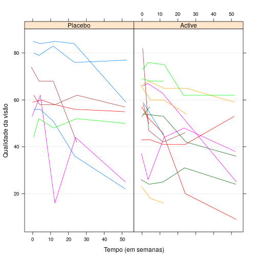
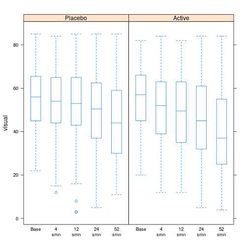

Modelos de Regressão Linear Mistos para dados discretos: Uma abordagem utilizando MCMC através do Stan integrado ao R
========================================================
author: 
  - Felipe Vieira - RA 160424
  - Guilherme Artoni - RA 160318

Degeneração macular relacionada à idade (DMRI)
========================================================

- É uma doença atualmente sem cura;
- Leva a perda progressiva da visão central;
- Visão turva é o principal sintoma;
- É muito comum em pessoas com mais de 55 anos.

Dados
========================================================

- Grupo de Estudo de Terapias Farmacológicas para Degeneração Macular;
- O objetivo é avaliar se um novo medicamento para DMRI tem poder competitivo com o principal existente no mercado;
- Ensaios clínicos aleatorizados;
- Realizados em diferentes centros de estudos;
- 240 pacientes;
- Foi medida a  qualidade da visão de todos os pacientes no início e após 4, 12, 24 e 52 semanas.

Análise Descritiva
========================================================



Análise Descritiva
========================================================

<table>
<caption>Número de observações, médias e medianas de cada semana obervada.</caption>
 <thead>
  <tr>
   <th style="text-align:left;">   </th>
   <th style="text-align:center;"> P:n </th>
   <th style="text-align:center;"> A:n </th>
   <th style="text-align:center;"> P:Média </th>
   <th style="text-align:center;"> A:Média </th>
   <th style="text-align:center;"> P:Mediana </th>
   <th style="text-align:center;"> A:Mediana </th>
  </tr>
 </thead>
<tbody>
  <tr>
   <td style="text-align:left;"> Início </td>
   <td style="text-align:center;"> 119 </td>
   <td style="text-align:center;"> 121 </td>
   <td style="text-align:center;"> 55.34 </td>
   <td style="text-align:center;"> 54.58 </td>
   <td style="text-align:center;"> 56.0 </td>
   <td style="text-align:center;"> 57.0 </td>
  </tr>
  <tr>
   <td style="text-align:left;"> 4smn </td>
   <td style="text-align:center;"> 117 </td>
   <td style="text-align:center;"> 114 </td>
   <td style="text-align:center;"> 53.97 </td>
   <td style="text-align:center;"> 50.91 </td>
   <td style="text-align:center;"> 54.0 </td>
   <td style="text-align:center;"> 52.0 </td>
  </tr>
  <tr>
   <td style="text-align:left;"> 12smn </td>
   <td style="text-align:center;"> 117 </td>
   <td style="text-align:center;"> 110 </td>
   <td style="text-align:center;"> 52.87 </td>
   <td style="text-align:center;"> 48.67 </td>
   <td style="text-align:center;"> 53.0 </td>
   <td style="text-align:center;"> 49.5 </td>
  </tr>
  <tr>
   <td style="text-align:left;"> 24smn </td>
   <td style="text-align:center;"> 112 </td>
   <td style="text-align:center;"> 102 </td>
   <td style="text-align:center;"> 49.33 </td>
   <td style="text-align:center;"> 45.46 </td>
   <td style="text-align:center;"> 50.5 </td>
   <td style="text-align:center;"> 45.0 </td>
  </tr>
  <tr>
   <td style="text-align:left;"> 52smn </td>
   <td style="text-align:center;"> 105 </td>
   <td style="text-align:center;"> 90 </td>
   <td style="text-align:center;"> 44.44 </td>
   <td style="text-align:center;"> 39.10 </td>
   <td style="text-align:center;"> 44.0 </td>
   <td style="text-align:center;"> 37.0 </td>
  </tr>
</tbody>
</table>

Análise Descritiva
========================================================



 Análise Descritiva
========================================================

* Matriz de Variâncias e Covariâncias


```
       Início   4smn  12smn  24smn  52smn
Início 220.31 206.71 196.24 193.31 152.71
4smn   206.71 246.22 224.79 221.27 179.23
12smn  196.24 224.79 286.21 257.77 222.68
24smn  193.31 221.27 257.77 334.45 285.23
52smn  152.71 179.23 222.68 285.23 347.43
```

 Análise Descritiva
========================================================

*  Matriz de Correlações


```
       Início 4smn 12smn 24smn 52smn
Início   1.00 0.89  0.78  0.71  0.55
4smn     0.89 1.00  0.85  0.77  0.61
12smn    0.78 0.85  1.00  0.83  0.71
24smn    0.71 0.77  0.83  1.00  0.84
52smn    0.55 0.61  0.71  0.84  1.00
```

Modelo Misto
========================================================

$$\boldsymbol{Y}_{j(k_{j} \ \text{x} \ 1)} = \boldsymbol{X}_{j(k_{j} \ \text{x} \ p)}\boldsymbol{\beta}_{(p \ \text{x} \ 1)} + \boldsymbol{Z}_{j(k_{j} \ \text{x} \ q)}\boldsymbol{b}_{j(q \ \text{x} \ 1)}+\boldsymbol{\xi}_{j(k_{j} \ \text{x} \ 1)}$$
Onde j = 1,2,...,n é o individuo

* $\boldsymbol{Y}_{j} = (y_{j1},...,y_{jk_{j}})$: vetor resposta, no qual $k_{j}$ é o número de avaliações realizadas no individuo j.
* $\boldsymbol{X}_{j}$: matriz de planejamento associada aos efeitos fixos para o indivíduo j.
* $\boldsymbol{\beta}$: vetor de efeitos fixos
* $\boldsymbol{Z}_{j}$: matriz de planejamento associada aos efeitos aleatórios para o indivíduo j.
* $\boldsymbol{b}_{j}$: vetor de efeitos aleatórios associado ao indivíduo j.
* $\boldsymbol{\xi}_{j}$: vetor de erros associado ao indivíduo j.

Modelo Proposto
========================================================

$$Y_{it} = \beta _0 + \beta _1 x_{1i} + \beta _2 x_{2it} + \beta _3 x_{3i} + \beta _4 x_{2it} x_{3i} + b_{0i} + \xi _{it},$$

* $Y_{it}$ é a qualidade da visão do paciente i (i = 1, ..., 240) no tempo t (t = 1, 2, 3, 4, correspondendo aos valores 4º, 12º, 24º e 52º semana, respectivamente);
* $x_{1i}$ é o valor inicial da qualidade da visão;
* $x_{2it}$ é o tempo t de medição no paciente i;
* $x_{3i}$ é o indicador do tratamento, 0 se placebo e 1 caso contrário;
* $x_{2it} x_{3i}$ é a interação entre as duas covariáveis.

Modelo Proposto
========================================================

$$Y_{it} = \beta _0 + \beta _1 x_{1i} + \beta _2 x_{2it} + \beta _3 x_{3i} + \beta _4 x_{2it} x_{3i} + b_{0i} + \xi _{it},$$

* $\beta _0$ é o intercepto geral;
* $\beta _1$ é o incremento positivo ou negativo no valor esperado de $Y_{it}$ quando variado em uma unidade o valor inicial da qualidade da visão;
* $\beta _2$ é o incremento positivo ou negativo na valor esperado de $Y_{it}$, quando acrescido o tempo em uma semana entre as que foram observadas;
* $\beta _3$ é o efeito geral positivo ou negativo no valor esperado de $Y_{it}$ causado pelo tratamento;
* $\beta _4$ é o incremento positivo ou negativo sobre o valor esperado de $Y_{it}$, gerado pela variação do tempo em uma semana entre as que foram observadas sobre o paciente i que estava sob tratamento.

Modelo Proposto
========================================================

* $b_{0i}$ é o efeito aleatório específico para cada paciente. Tal que $b_{0i} \sim \cal{N}(\text{0}, \ \tau) \ \forall$ i;
* $\xi _{it}$ é o erro aleatório. Tal que  $\xi _{it} \overset{\small{iid}}{\sim} \cal{N}(\text{0}, \ \sigma ^\text{2}) \ \forall$ i e t;
* $b_{0i}$ representa uma variação especifica do $\beta _0$ para cada paciente.

Modelo Proposto
========================================================

* Forma matricial do modelo para o indivíduo i

$$
\begin{pmatrix}
Y_{i1} \\
Y_{i2} \\
Y_{i3} \\
Y_{i4} \\
\end{pmatrix} 
=  
\begin{pmatrix}
1 & x_{1i} & 4 & x_{3i} & 4x_{3i}\\ 
1 & x_{1i} & 12 & x_{3i} & 12x_{3i}\\
1 & x_{1i} & 24 & x_{3i} & 24x_{3i}\\
1 & x_{1i} & 52 & x_{3i} & 52x_{3i}\\
\end{pmatrix}
\begin{pmatrix}
\beta_0 \\
\beta_1 \\
\beta_2 \\
\beta_3 \\
\beta_4 \\
\end{pmatrix} +
\begin{pmatrix}
1 \\
1 \\
1 \\
1 \\
\end{pmatrix} b_{0t}
+ \begin{pmatrix}
\xi_{i1} \\
\xi_{i2} \\
\xi_{i3} \\
\xi_{i4} \\
\end{pmatrix}
$$

Modelo Proposto
========================================================

* Estrutura Uniforme da matriz de Variâncias e Covariâncias

$$
\begin{pmatrix}
\sigma^{{2}} + \tau & \tau & \tau & \tau \\
\tau & \sigma^{{2}} + \tau & \tau & \tau \\
\tau & \tau & \sigma^{{2}} + \tau & \tau \\
\tau & \tau & \tau & \sigma^{{2}} + \tau
\end{pmatrix}
$$

Slide With Plot
========================================================

$$\alpha(\theta,\phi) = min\{1,\frac{\pi(\phi)\text{q}(\phi,\theta)}{\pi(\theta)\text{q}(\theta,\phi)}\}$$
